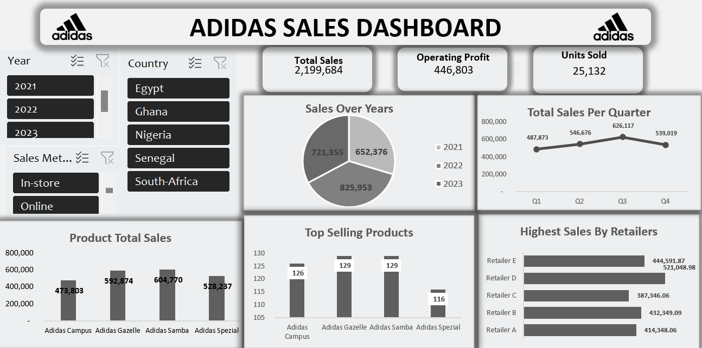

# Loveline-s-Portfolio
Analytics Portfolio
## First Project:  Organix sales performance analysis
This analysis is to show the performance analysis of the branches total sales by the average sales, average monthly sales, the payment method by gross income, the product line by customer type and the predictive sales.

## Second Project:   Udemy Course Analysis
### Objective

The aim of this project is basically to analyze the revenue and subscriber base of the online learning platform Udemy over 6 years from 2011 to 2017 and provide actionable insights based on the analysis.
Web development courses stood out as a major contributor to an increased number of subscribers and a significant share of the total revenue, generating 8M in subscribers and $631M in Total Revenue. 

### Insights
1. Lectures by subject
2. Subject by review
3. Subject by subscribers
4. Subjects by total price
5. Number of subscribers by course duration
6. Top courses by highest subscribers
7. Average price by subject

### Third Project:  Sneakers Sales Analysis
This analysis aims to identify trends, patterns, and key factors influencing sales, enabling the company to make informed strategic decisionsfor Adidas to understand the sales performance of its sneakers over the past three years, from 2021 to 2023.

### Objectives
- The objectives of this project was aimed at:
- Analyzing the sales data to determine which platforms and product categories perform the best and using this information to provide guidance for future business strategies.
- Identifying regions with the highest sales performance, using this insight to suggest strategies for targeting markets more effectively.
- Develop recommendations for marketing, product development, and distribution strategies to maximize sales and improve consumer engagement.

#### Insights
1. From the analysis above, it is seen that over the period of 3years, i.e from 2021–2024, about 25,132 units of sneakers were sold with a total sale of $2,199,684 at an operating profit of $446,803.
2. Retailer D has had an outstanding sales performance over the years while Retailer C has had the lowest sales performance in the last 3 years.
3. A lot of customers prefers buying in-store than online.
4.Nigeria is the top selling country in the last 3 years with a generated revenue of $923,828 while Senegal has had a trend of low sales over the years with sales of $194,579

##### Recommendations

- Nigeria has a good market for sneakers so more the marketing budget for sneakers should be increased as Nigeria is a revenue generating country.
- Senegal does not have a so good sales record, hence marketing should be done while the retailers for Senegal can have more trainings so their sales can improve.
- Adidas should prioritize Retailer D as they contribute greatly to the profitability of the company, hence partnership deals should be put in place for Retailer D
  
Summarily, this will help Adidas to know the sales trend of sneakers sales ensuring sustainable growth and profitability with its competitors when it comes to sneakers

